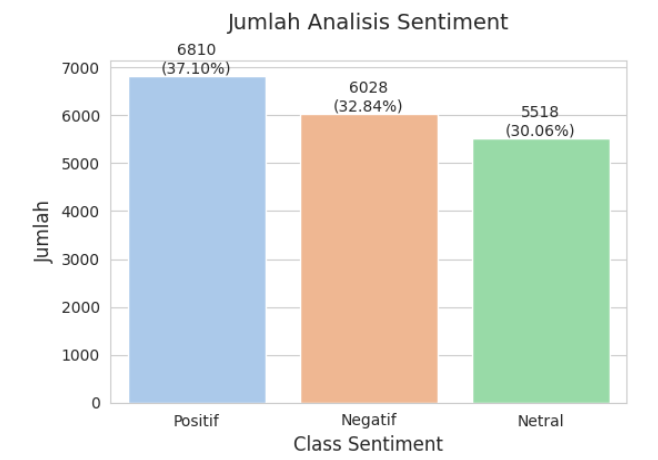
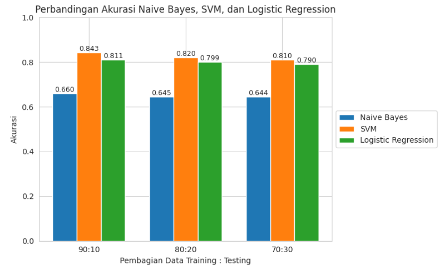
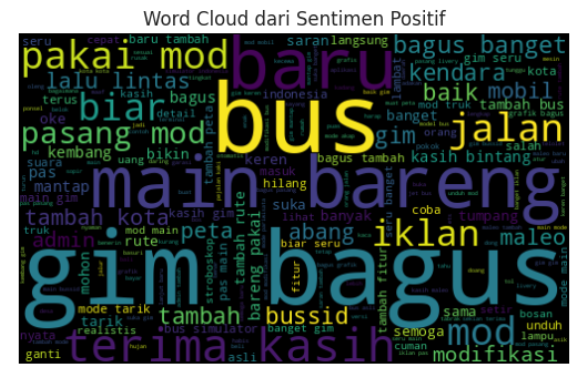
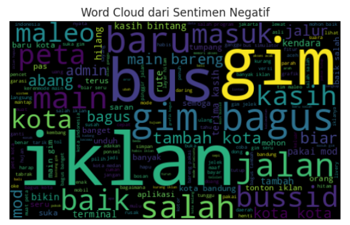
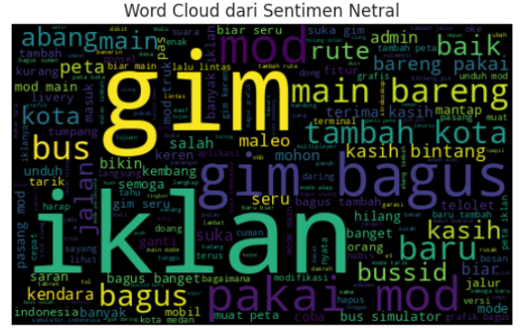

# Analysis Results

This folder contains the main results and visualizations from the sentiment analysis of Bus Simulator Indonesia (BUSSID) user reviews.

## 1. Sentiment Distribution

The sentiment analysis resulted in three sentiment classes:

- Positive: 6,810 reviews (37.10%)
- Negative: 6,028 reviews (32.84%)
- Neutral: 5,518 reviews (30.06%)

## 2. Model Accuracy Comparison

Three machine learning algorithms were evaluated:

- Naive Bayes
- Support Vector Machine (SVM)
- Logistic Regression

The models were evaluated using three training-testing data splits:

- 90:10
- 80:20
- 70:30

## 3. Word Cloud

### Positive Sentiment

### Negative Sentiment

### Neutral Sentiment

